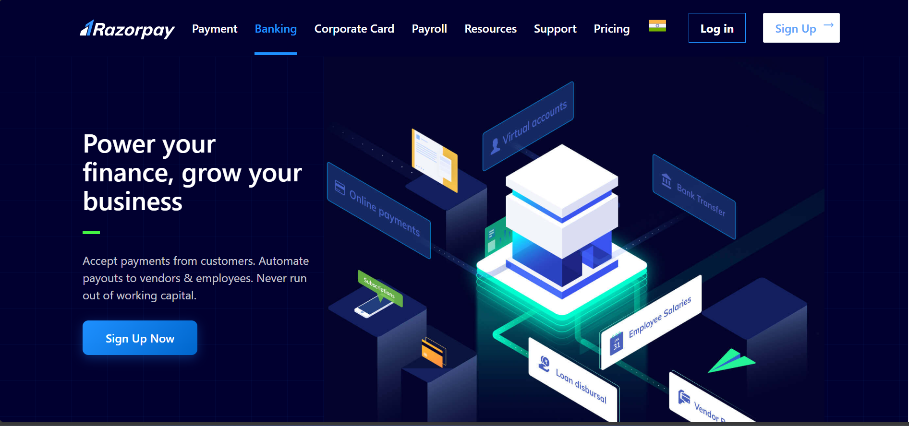
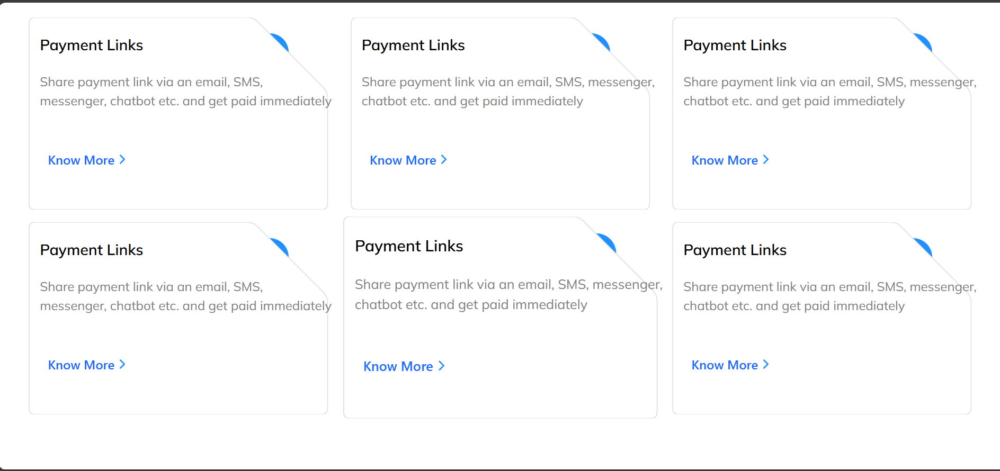
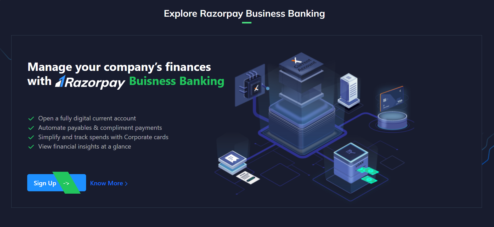
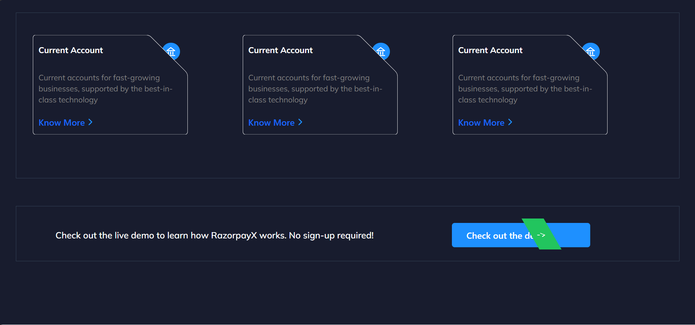
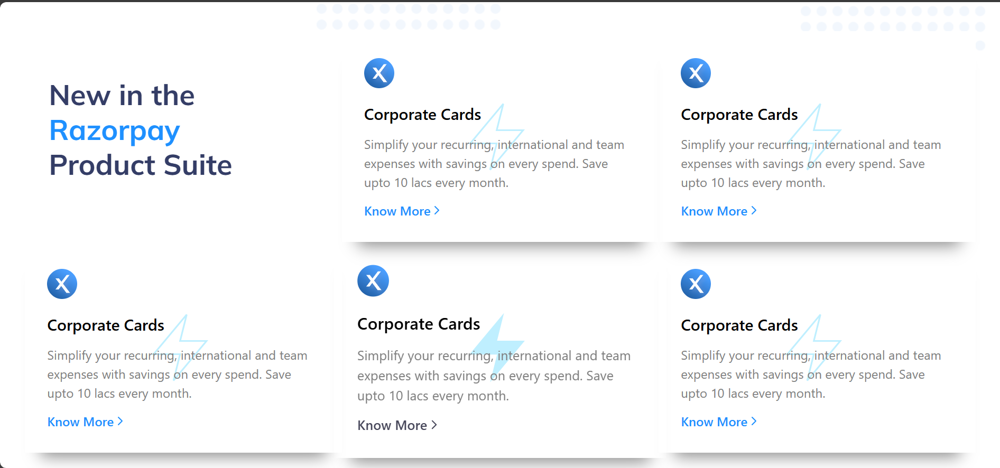
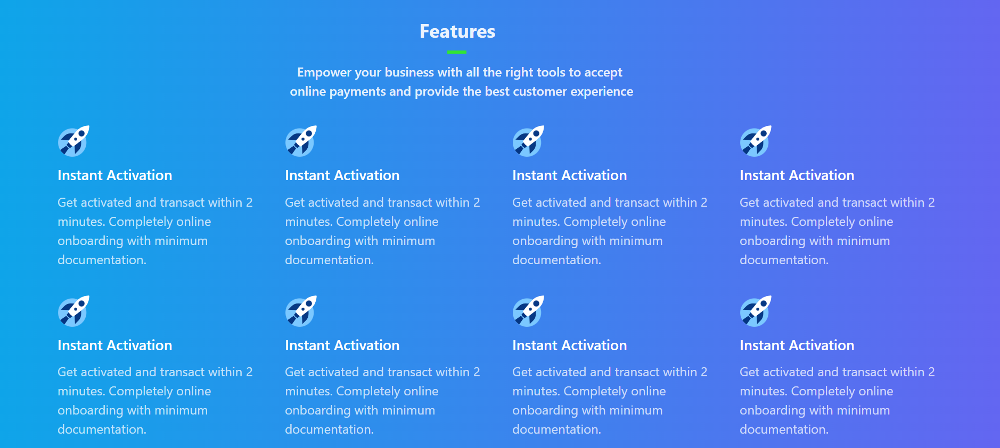
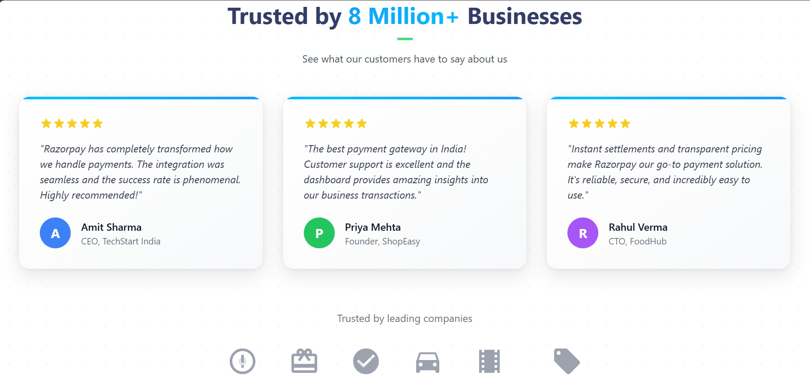
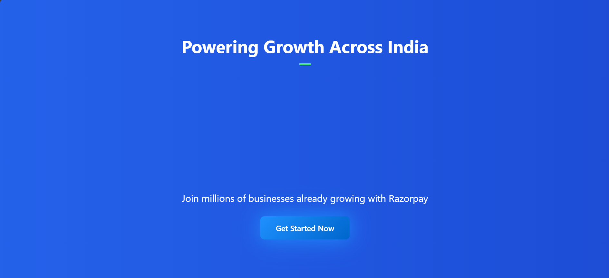
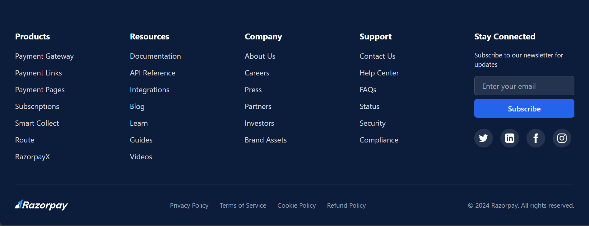

<div align="center">


[](https://developer.mozilla.org/en-US/docs/Web/HTML)
[](https://developer.mozilla.org/en-US/docs/Web/CSS)
[](https://developer.mozilla.org/en-US/docs/Web/JavaScript)
[](https://tailwindcss.com/)

[](https://github.com)
[](https://github.com)
[](https://vercel.com)

### 🌐 [**LIVE DEMO**](https://razorpay-clone-devkartik.vercel.app/) 🚀

[](https://razorpay-clone-devkartik.vercel.app/)

</div>

---

## ✨ Features

- 🎨 **Modern Design** - Clean and professional UI
- 📱 **Fully Responsive** - Works on mobile, tablet, and desktop
- ⚡ **Smooth Animations** - Engaging transitions and effects
- 💳 **Complete Sections** - Hero, Features, Testimonials, Stats, Footer
- 🎯 **Interactive Elements** - Hover effects and mobile menu
- 🌈 **Creative CSS** - Glassmorphism, gradients, and premium styling

## 🛠️ Technologies

- **HTML5** - Semantic markup
- **CSS3** - Custom animations and Tailwind CSS
- **JavaScript** - Interactive features
- **Responsive Design** - Mobile-first approach

## 🚀 Quick Start

1. **Clone or download** this repository
2. **Open** `index.html` in your browser
3. **That's it!** No build process needed.

## 📂 Project Structure

```
RazorpayTCSS/
├── index.html          # Main HTML file
├── main.css            # Styles and animations
├── responsive.css      # Mobile responsive styles
├── script.js           # JavaScript functionality
├── screenshots/        # Project screenshots
└── README.md           # This file
```

## 📸 Screenshots

### 🏠 Hero Section
The landing page with eye-catching hero section and call-to-action.



---

### 💳 Payment Suite
Comprehensive payment gateway features and benefits.


---

### 🎯 Features Grid
Interactive feature cards with hover effects.



---

### 🏦 Business Banking
Business banking solutions and services.



---

### 🆕 New Products
Latest product offerings and innovations.



---

### ⭐ Features Showcase
Detailed features with icons and descriptions.



---

### 💬 Testimonials
Customer reviews and trusted company logos.



---

### 📊 Statistics
Impressive stats with glassmorphism design.



---

### 🦶 Footer
Comprehensive footer with links and newsletter.



---

### 📱 Mobile View
Fully responsive design on mobile devices.



---

## 🌐 Live Demo

### 🚀 **[View Live Site](https://razorpay-clone-devkartik.vercel.app/)**

The project is deployed and live on Vercel! Click the link above to see it in action.

### Want to deploy your own version?

[](https://vercel.com/new/clone?repository-url=https://github.com/YOUR_USERNAME/razorpay-clone)

1. Click the button above or go to [vercel.com](https://vercel.com)
2. Sign in with GitHub
3. Import this repository
4. Click **"Deploy"**

Your site will be live in seconds! 🎉

📖 See [DEPLOYMENT_GUIDE.md](./DEPLOYMENT_GUIDE.md) for detailed deployment instructions.

## 💡 Key Highlights

<div align="center">

| Feature | Description |
|---------|-------------|
| 📱 **Responsive** | Works perfectly on all devices |
| ⚡ **Fast** | Optimized for performance |
| 🎨 **Modern UI** | Glassmorphism & gradients |
| 🔧 **Easy Deploy** | One-click Vercel deployment |
| 💯 **Complete** | All sections implemented |
| 🎯 **Interactive** | Smooth animations & effects |

</div>

## 📱 Responsive Breakpoints

- **Mobile**: < 640px
- **Tablet**: 641px - 1024px  
- **Desktop**: > 1024px

## 🎨 Design Features

- ✅ Premium card designs with animated borders
- ✅ Gradient backgrounds and text
- ✅ Smooth scroll animations
- ✅ Interactive hover effects
- ✅ Custom scrollbar styling
- ✅ Glassmorphism effects

## 📝 License

MIT License - Free to use for learning and personal projects.

## 👨‍💻 Author

Made with ❤️ and lots of ☕

---

<div align="center">

### 🌟 If you found this helpful, please star the repo!

**Happy Coding!** 🚀✨

</div>
